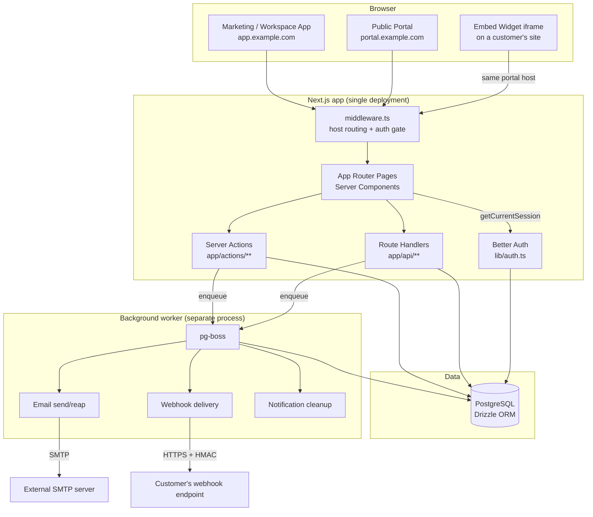
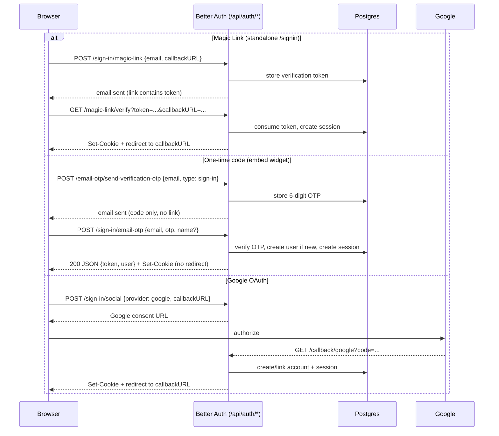

# IdeaRoads — Production Readiness Review

**Reviewed:** current `main` branch, working tree as of this review.
**Reviewer role:** Senior Staff Engineer / Security / DevOps / Solutions Architect pass.
**Method:** static analysis of the repository only — no code was modified to produce this document.

---

## 1. Executive Summary

**Project purpose.** IdeaRoads is an open-source, self-hostable customer feedback platform in the mould of Canny/Fider: brands collect feature requests, let users vote and comment, run a public roadmap, and publish a changelog — all under the brand's own domain, multi-tenant, MIT licensed (`LICENSE`, `config/platform.ts`).

**Primary features** (see `docs/MASTER.md` for the authoritative product spec):

- Passwordless auth (Magic Link, one-time email code, Google OAuth)
- Multi-tenant workspaces with a 4-role model (Orbit Admin / Brand Admin / Team Member / User)
- Feedback boards, posts, voting, threaded comments with reactions
- Categories, workflow statuses, moderation (approval rules, blocking users)
- Public roadmap (auto-derived from statuses, or a manual drag-and-drop board)
- Public changelog with reactions, comments, RSS feed, email subscriptions
- Notifications (email + in-app)
- Team management, invites (email + shareable link), audit log
- Outbound webhooks (HMAC-signed) and a read-only public API (`/api/v1`)
- An embeddable JS widget (`public/widget.js`) that surfaces a workspace's board/roadmap/changelog inside a third-party site via iframe, with in-place authentication
- An internal "Orbit" platform-admin area (workspace oversight, feature flags, plans, platform settings)

**Current development status.** Actively developed, pre-production. Core feedback/voting/changelog/roadmap functionality is built and covered by tests. The embed widget is the newest, least battle-tested subsystem (built and iterated across this review period). No CI pipeline, no deployment automation, no monitoring/alerting exist yet.

**Technology stack:** Next.js 16 (App Router) · TypeScript · PostgreSQL + Drizzle ORM · Better Auth · pg-boss · Nodemailer/React Email · Biome · Vitest. Full detail in [§3](#3-tech-stack).

**Overall architecture:** A single Next.js deployment optionally split across two hostnames (Workspace/Admin app vs. Public Portal) sharing one database, one Better Auth instance, and host-scoped session cookies for isolation. Background work (email sending, webhook delivery, notification cleanup) runs through a separate `pg-boss`-backed worker process. Full detail in [§4](#4-application-architecture).

**Estimated production readiness: ~45/100.** The application logic is solid and reasonably well-tested where it exists, but the operational/production layer (CI, monitoring, rate limiting, security headers, health checks, backups, a hardened cross-site-cookie posture for the embed widget) is largely absent. See [§28](#28-overall-scorecard) for the full breakdown.

**Biggest strengths:**

- Clean domain-oriented code organization (`lib/<domain>/queries.ts` + `app/actions/<domain>.ts` pattern, consistently applied)
- Thoughtful, unusual-for-this-project-size security details already in place: outbound webhooks are HMAC-signed with timestamps _and_ SSRF-guarded (blocks private/loopback IPs, HTTPS-only — `lib/worker/handlers/deliver-outbound-webhook.ts`); API keys are stored as SHA-256 hashes, never plaintext (`lib/api-keys/validate.ts`); sensitive settings (e.g. SMTP password) are AES-256-GCM encrypted at rest (`lib/encrypt.ts`)
- Deliberate, documented two-host session-isolation architecture for Workspace vs. Public Portal (`middleware.ts`, `docs/migration/01-portal-subdomain-auth.md`)
- A genuine product specification (`docs/MASTER.md`, `docs/PLATFORM.md`) that most side/early-stage projects don't have

**Biggest weaknesses:**

- No rate limiting on any first-party API route (only Better Auth's own endpoints are rate-limited)
- No security headers, no CSP, no CORS policy anywhere in the app
- The embed widget's session cookies are `SameSite=Lax`, which does not survive being embedded in a third-party iframe on a different site — a currently-open, unresolved architectural gap (see [§14](#14-security-audit))
- Zero CI/CD, no automated deploy pipeline, no health-check endpoint, no monitoring/alerting/error-tracking service wired up
- No E2E tests and no test-coverage tooling; unit/integration test coverage is real but narrow (14 test files, concentrated in a handful of modules)

---

## 2. Project Structure

```
app/
├── (auth)/                 # /signin, /signup — standalone full-page auth screens
├── (marketing)/            # Public marketing site: /, /features/*, /demo, /privacy, /terms
├── (orbit)/orbit/          # Platform-admin area (Orbit Admin role only)
├── (public)/[slug]/        # Public Portal: board list, post detail, roadmap, changelog, profile
├── (workspace)/[slug]/     # Workspace/Admin app: feedback inbox, settings, notifications
├── account/                # Cross-cutting account pages (profile, confirm-email)
├── actions/                # Next.js Server Actions, one file per domain
├── api/                    # Route handlers — see §6/§8
├── dashboard/               # Redirect helper into a workspace
├── embed-auth-complete/     # Shared landing page for the embed widget's popup/OTP auth
├── invite/                  # Invite-by-email and invite-by-link acceptance pages
├── onboarding/               # First-workspace creation flow
└── post-auth/                # Post-sign-in router (picks /orbit, /{workspace}, or /onboarding)

components/                # ~182 .tsx files, organized by domain (voting/, comments/, changelog/,
                            # roadmap/, embed/, portal/, workspace/, admin/, ui/ [shadcn primitives], …)

lib/                        # ~118 .ts files — the domain/business-logic layer:
├── auth.ts / auth-client.ts # Better Auth server + client configuration
├── api-keys/, webhooks/     # External API surface support
├── boards/, posts/, voting/, comments/, categories/, workspace-statuses/
├── roadmap/, changelog/, changelog-comments/
├── embed/                   # Embed widget query/config/snippet-generation logic
├── notifications/, email/, smtp/
├── orbit/                   # Platform-admin queries (feature flags, plans, settings)
├── storage/                 # Local-disk / S3 file storage abstraction
├── worker/                  # pg-boss job definitions + handlers
├── audit/                   # Audit-log writer
├── encrypt.ts               # AES-256-GCM helper for at-rest secrets
└── authz.ts                 # getCurrentSession / requireSession / requireAdmin

db/
├── schema/                  # 29 files, 39 Drizzle table definitions
└── migrations/               # 25 SQL migrations (Drizzle Kit generated)

config/platform.ts          # Product-wide constants (roles, limits, reserved slugs, reactions)
hooks/                       # Shared React hooks
public/                      # Static assets + public/widget.js (the embeddable widget script)
scripts/                    # One-off/dev scripts: worker entrypoint, db seeding, make-admin, etc.
tests/                       # Vitest suite (14 files) — see §20
docs/                        # Product spec (MASTER.md, PLATFORM.md, features/) +
                              # implementation reference (ARCHITECTURE.md, DATABASE.md, TECH-STACK.md, JOBS.md)
middleware.ts                # Host-based routing (Workspace vs Portal) + auth-gate for a few prefixes
instrumentation.ts           # next.js onRequestError hook — logs uncaught server errors
Dockerfile.worker            # Container build for the background worker only (no app Dockerfile)
```

Directories requested by the template but **not present in this project**: `middleware/` (folder) — middleware is a single root-level `middleware.ts` file, standard for Next.js App Router. `database/` — replaced by `db/`. `utils/` — utility code lives inside `lib/` per-domain rather than a generic utils folder (plus a `lib/utils.ts` for small shared helpers).

---

## 3. Tech Stack

| Category         | Choice                                                                                                                                                | Version                                                   |
| ---------------- | ----------------------------------------------------------------------------------------------------------------------------------------------------- | --------------------------------------------------------- |
| Framework        | Next.js (App Router, Turbopack dev)                                                                                                                   | 16.2.9                                                    |
| Runtime          | Node.js (via `tsx` for scripts/worker)                                                                                                                | not pinned in `package.json`/`.nvmrc` — **not specified** |
| Language         | TypeScript                                                                                                                                            | ^6.0.3                                                    |
| Database         | PostgreSQL (via `postgres` driver); local dev uses `embedded-postgres`                                                                                | driver `^3.4.9`, embedded-postgres `18.4.0-beta.17`       |
| ORM              | Drizzle ORM + Drizzle Kit                                                                                                                             | `^0.45.2` / `^0.31.10`                                    |
| Authentication   | Better Auth (Magic Link, Email-OTP, Google OAuth, Admin plugin)                                                                                       | `^1.6.18`                                                 |
| UI Library       | shadcn/ui (Radix UI + `radix-ui` + `@base-ui/react` primitives), Tailwind CSS v4                                                                      | `radix-ui ^1.5.0`, `tailwindcss ^4.3.1`                   |
| State Management | React state/hooks + Server Components; no global client store (no Redux/Zustand/Jotai)                                                                | —                                                         |
| Styling          | Tailwind CSS v4 + `tailwind-merge`, `class-variance-authority`, custom `ir-*` design tokens (`DESIGN-TOKENS.md`)                                      | —                                                         |
| Deployment       | Not automated — `Dockerfile.worker` exists for the worker only; no app-level Dockerfile, no hosting config found (no `vercel.json`, no k8s manifests) | **Not Implemented**                                       |
| Package Manager  | pnpm                                                                                                                                                  | 11.6.0 (`packageManager` field)                           |
| Background Jobs  | pg-boss (Postgres-backed queue, no Redis)                                                                                                             | `^12.19.1`                                                |
| File Storage     | Local disk (`public/uploads`) by default; AWS S3 / R2 / any S3-compatible endpoint via `STORAGE_S3_*` env vars                                        | `@aws-sdk/client-s3 ^3.700.0`                             |
| Email            | Nodemailer (SMTP) + React Email for templates                                                                                                         | `nodemailer ^8.0.11`, `react-email ^6.6.0`                |
| Payments         | **Not Implemented** — no Stripe/payment provider anywhere in the codebase                                                                             | —                                                         |
| Analytics        | **Not Implemented** — no analytics SDK found                                                                                                          | —                                                         |
| Logging          | `console.log`/`console.error` only, plus `instrumentation.ts`'s `onRequestError` hook; no structured/shipped logging                                  | —                                                         |
| Testing          | Vitest (unit/integration, real Postgres via `embedded-postgres`); no E2E framework                                                                    | `vitest ^4.1.9`                                           |
| CI/CD            | **Not Implemented** — no `.github/workflows`, no other CI config found                                                                                | —                                                         |

---

## 4. Application Architecture

### 4.1 High-level architecture



### 4.2 Request lifecycle

1. Request hits `middleware.ts`. If `NEXT_PUBLIC_ADMIN_URL`/`NEXT_PUBLIC_PORTAL_URL` are distinct, the host is classified as Admin or Portal; Portal-only paths (`/{slug}/b/*`, `/roadmap`, `/changelog`, `/profile`) requested on the Admin host are 307-redirected to the Portal host and vice versa. A small `AUTH_GATE_PREFIXES` list (`/orbit`, `/account`, `/onboarding`, `/post-auth`, `/invite/link`) does a cookie-presence check and redirects to `/signin` if absent.
2. The matched Server Component (`page.tsx`) runs on the server, calling `getCurrentSession()` (`lib/authz.ts` → `auth.api.getSession()`) and domain query functions (`lib/<domain>/queries.ts`) directly against Postgres via Drizzle — no internal HTTP hop.
3. Interactive elements are Client Components (`"use client"`) that call either a Server Action (`app/actions/*.ts`, same-process function call) or a Route Handler (`app/api/**/route.ts`, a real HTTP round trip) for mutations — vote, comment, embed config, etc.
4. Mutations that have side effects beyond the DB row (sending an email, delivering a webhook) call `lib/worker/enqueue.ts` to push a `pg-boss` job; the actual work happens asynchronously in the separate worker process (`scripts/worker.ts`), decoupling user-facing request latency from email/webhook delivery.

### 4.3 Authentication flow



Both hosts (Admin/Portal) are `trustedOrigins`; Better Auth's dynamic `baseURL` resolves per-request to whichever of the two hosts the request came in on, so a magic-link/OAuth flow always returns the visitor to the host they started on (`lib/auth.ts`). Sessions are **host-only cookies** (no `Domain=` attribute) — signing in on the Portal host never authenticates the Admin host, by design (`docs/migration/01-portal-subdomain-auth.md`).

### 4.4 Authorization flow

- `getCurrentSession()` / `requireSession()` / `requireAdmin()` (`lib/authz.ts`) are the three building blocks used throughout Server Components, Server Actions, and Route Handlers.
- Workspace-level authorization checks `workspaceMembers.role` (`owner`/`admin`/`member` — product-facing labels "Brand Admin"/"Team Member", `config/platform.ts`) via `getWorkspaceMember()`.
- Platform-level authorization (`requireAdmin`) checks `user.role === "admin"` and additionally re-reads the user's `banned` flag fresh from the DB on every call rather than trusting the session snapshot.
- Orbit Admin area (`app/(orbit)/orbit/**`) is deliberately invisible (404, not redirect) to non-Orbit-Admins, so its existence isn't revealed to unauthorized users.
- External API access (`/api/v1/*`) uses a completely separate, stateless auth path: `Authorization: Bearer <key>` / `x-api-key` header, validated against a SHA-256 hash (`lib/api-keys/validate.ts`) — no cookies/sessions involved.

### 4.5 File upload flow

Comment/post images go through `lib/storage/index.ts`, which dispatches to `lib/storage/local.ts` (writes under `public/uploads`, served statically) or `lib/storage/s3.ts` (AWS SDK v3 `PutObjectCommand`) depending on whether `STORAGE_S3_*` env vars are set. No client-side or server-side file-type/size validation was found beyond what the upload UI itself restricts — see [§14](#14-security-audit).

### 4.6 Payment flow

**Not Implemented.** No billing/payment code exists (`lib/orbit/plans` manages _display_ of plan tiers/limits for the platform admin, not actual billing integration).

### 4.7 Embed widget architecture (notable, non-standard subsystem)

`public/widget.js` is a vanilla-JS IIFE (no framework, no build step) that customers paste as a `<script data-workspace data-board ...>` tag. It validates required attributes client-side and renders a visible error box (never a broken iframe/redirect) if `data-workspace`/`data-board` are missing, then mounts an iframe pointed at the Portal host's board/roadmap/changelog pages with `?embed=1`. Inside the iframe, `useIsEmbed()` (`components/embed/use-is-embed.ts`) drives conditional rendering (hiding the normal header/nav) and every authenticated action (vote, comment, react, subscribe, create feedback) opens an in-place `EmbedAuthDialog` instead of navigating away, backed by the one-time-code flow in §4.3. This is the most recently built and least production-hardened part of the app — see the `SameSite` cookie finding in [§14](#14-security-audit).

---

## 5. Feature Inventory

| Feature                                        | Status                         | Key files                                                                                                             | DB tables                                                                                                                            | Known limitations                                                                                                                                                         |
| ---------------------------------------------- | ------------------------------ | --------------------------------------------------------------------------------------------------------------------- | ------------------------------------------------------------------------------------------------------------------------------------ | ------------------------------------------------------------------------------------------------------------------------------------------------------------------------- |
| Authentication (Magic Link, Email-OTP, Google) | Implemented                    | `lib/auth.ts`, `lib/auth-client.ts`, `app/(auth)/_components/auth-form.tsx`, `components/embed/embed-auth-panel.tsx`  | `user`, `session`, `account`, `verification`                                                                                         | Session cookies are `SameSite=Lax`, which breaks in the cross-site embed-iframe case (see §14)                                                                            |
| Workspaces & onboarding                        | Implemented                    | `app/onboarding/`, `lib/workspaces/`                                                                                  | `workspaces`, `workspaceMembers`                                                                                                     | `MAX_WORKSPACES_PER_USER = 10` hardcoded in `config/platform.ts`; no self-serve workspace deletion flow found beyond Orbit                                                |
| Team members & invites                         | Implemented                    | `app/(workspace)/[slug]/settings/members/`, `lib/workspaces/invites.ts`                                               | `workspaceInvites`, `workspaceInviteLinks`                                                                                           | Fixed single "Team Member" permission level — no granular roles                                                                                                           |
| Feedback boards                                | Implemented                    | `lib/boards/`, `app/(workspace)/[slug]/settings/` (board management folded into workspace settings)                   | `boards`                                                                                                                             | —                                                                                                                                                                         |
| Feedback posts                                 | Implemented                    | `lib/posts/`, `app/(workspace)/[slug]/feedback/`                                                                      | `posts`, `postStatusChanges`                                                                                                         | —                                                                                                                                                                         |
| Voting                                         | Implemented                    | `lib/voting/`, `components/voting/vote-button.tsx`, `app/api/posts/[postId]/vote/route.ts`                            | `votes`                                                                                                                              | One vote per user per post enforced at the query layer, not a DB unique constraint verified in this review                                                                |
| Comments & replies                             | Implemented                    | `lib/comments/`, `components/comments/`                                                                               | `comments`, `commentReactions`                                                                                                       | One level of nesting only (by design, per `docs/MASTER.md`)                                                                                                               |
| Categories & statuses                          | Implemented                    | `lib/categories/`, `lib/workspace-statuses/`                                                                          | `categories`, `workspaceStatuses`                                                                                                    | —                                                                                                                                                                         |
| Moderation                                     | Implemented                    | `lib/moderation/block.ts`, `lib/moderation/queries.ts`, `app/(workspace)/[slug]/settings/moderation/`                 | `blockedUsers`                                                                                                                       | Scope of automated spam filtering not verified beyond manual block/approve                                                                                                |
| Public roadmap (derived + manual)              | Implemented                    | `lib/roadmap/`, `components/roadmap/`                                                                                 | `roadmapItems`, `roadmapStatuses`, `roadmapFollowers`                                                                                | `FollowRoadmapButton` component exists but is **not rendered anywhere** in the current UI — dead code, and its click handler targets a non-existent `/login` route        |
| Changelog                                      | Implemented                    | `lib/changelog/`, `lib/changelog-comments/`, `app/(public)/[slug]/changelog/`                                         | `changelogEntries`, `changelogPosts`, `changelogLabels`, `changelogComments`, `changelogCommentReactions`, `changelogEntryReactions` | —                                                                                                                                                                         |
| RSS feed                                       | Implemented                    | `app/(public)/[slug]/changelog/feed.xml/route.ts`                                                                     | —                                                                                                                                    | —                                                                                                                                                                         |
| Notifications (email + in-app)                 | Implemented                    | `lib/notifications/`, `components/notifications/`, `app/api/notifications/*`                                          | `notifications`, `notificationPreferences`                                                                                           | In-app bell is Workspace-app only, **not present on the Public Portal or the embed widget**                                                                               |
| Audit log                                      | Implemented                    | `lib/audit/`, `app/(workspace)/[slug]/settings/audit-log/`, `app/(orbit)/orbit/audit-log/`                            | `auditLogs`                                                                                                                          | —                                                                                                                                                                         |
| Outbound webhooks                              | Implemented                    | `lib/webhooks/`, `app/(workspace)/[slug]/settings/webhooks/`                                                          | `outboundWebhookEndpoints`, `outboundWebhookDeliveries`                                                                              | Good: HMAC-signed, SSRF-guarded, HTTPS-only (see §14)                                                                                                                     |
| Public API (`/api/v1`)                         | Implemented, read-only         | `app/api/v1/*`, `lib/api-keys/`                                                                                       | `apiKeys`                                                                                                                            | GET-only (posts, changelog, roadmap) — no write endpoints                                                                                                                 |
| Embed widget                                   | Implemented, actively hardened | `public/widget.js`, `components/embed/*`, `lib/embed/`                                                                | `workspaceEmbedConfig`                                                                                                               | See §4.7 and §14 for the open cross-site cookie issue                                                                                                                     |
| Orbit (platform admin)                         | Implemented                    | `app/(orbit)/orbit/**`, `lib/orbit/`                                                                                  | `featureFlags`, `platformSettings`                                                                                                   | —                                                                                                                                                                         |
| Feature flags                                  | Implemented                    | `lib/orbit/feature-flags.ts`                                                                                          | `featureFlags`                                                                                                                       | 6 flags shipped: `guest_voting`, `public_roadmap`, `public_changelog`, `magic_link_auth`, `google_auth`, `changelog_rss` — simple on/off, no percentage rollout/targeting |
| Impersonation                                  | Implemented                    | `app/api/orbit/users/[userId]/impersonate/route.ts`, `app/api/orbit/end-impersonation/`                               | —                                                                                                                                    | Gated behind `ENABLE_IMPERSONATION` env flag; uses Better Auth's `admin` plugin                                                                                           |
| Sitemap / robots.txt                           | **Not Implemented**            | `middleware.ts` reserves `/robots.txt` and `/sitemap.xml` in its matcher, but no route or static file produces either | —                                                                                                                                    | Dead reservation — nothing generates these files today                                                                                                                    |

---

## 6. Routing

### 6.1 Route groups (App Router)

| Group                | Host (when split) | Purpose                                                                                                                                                       |
| -------------------- | ----------------- | ------------------------------------------------------------------------------------------------------------------------------------------------------------- |
| `(marketing)`        | Admin             | Public marketing site: `/`, `/features`, `/features/roadmap`, `/features/changelog`, `/features/feedback-boards`, `/demo`, `/privacy`, `/terms`               |
| `(auth)`             | Both (dual-host)  | `/signin`, `/signup` — standalone full-page auth                                                                                                              |
| `(workspace)/[slug]` | Admin             | The brand-admin app: dashboard, `/feedback`, `/notifications`, `/settings/*` (12 settings sub-pages)                                                          |
| `(public)/[slug]`    | Portal            | The public-facing portal: `/b/[boardSlug]`, `/b/[boardSlug]/p/[postSlug]`, `/b/[boardSlug]/new`, `/roadmap`, `/changelog`, `/changelog/[entryId]`, `/profile` |
| `(orbit)/orbit`      | Admin             | Platform admin: users, workspaces, plans, feature flags, audit log, email, jobs, settings                                                                     |
| top-level            | Admin             | `/onboarding`, `/account/*`, `/dashboard`, `/invite/*`, `/post-auth`, `/embed-auth-complete` (dual-host)                                                      |

Full page inventory: **58** `page.tsx` files (enumerated during this review).

### 6.2 API routes (32 route files)

Grouped by surface:

- **Auth:** `app/api/auth/[...all]/route.ts` — catch-all mount for Better Auth.
- **Posts/voting/comments:** `app/api/posts/[postId]/{vote,comments}`, `app/api/posts/[postId]/vote/voters`, `app/api/comments/[commentId]/{route,approve,reactions}`.
- **Changelog:** `app/api/changelog/[entryId]/{comments,reactions}`, `app/api/changelog/comments/[commentId]/{route,approve,reactions}`.
- **Notifications:** `app/api/notifications/{route,count,[notificationId]}`.
- **Embed:** `app/api/embed/auth-config/route.ts` (public GET — tells the widget whether Google sign-in is available).
- **Workspace settings:** `app/api/workspaces/[slug]/{api-keys,webhooks,blocked-users,audit-log}` (+ nested `[keyId]`/`[endpointId]`/`[blockedId]`).
- **Orbit:** `app/api/orbit/{users/[userId]/impersonate,end-impersonation}`.
- **Public v1 API:** `app/api/v1/{posts,changelog,roadmap}` — Bearer-token authenticated, read-only.
- **Misc:** `app/api/account/export/route.ts` (data export), `app/api/unsubscribe/route.ts`, `app/api/webhooks/email/route.ts` (inbound email-provider webhook, `EMAIL_WEBHOOK_SECRET`-gated).

### 6.3 Middleware (`middleware.ts`)

- Host classification (`isPortalPath`/`isDualHostPath`) only activates when `NEXT_PUBLIC_ADMIN_URL` and `NEXT_PUBLIC_PORTAL_URL` resolve to distinct hosts; otherwise it's a no-op single-origin app.
- `AUTH_GATE_PREFIXES`: `/orbit`, `/account`, `/onboarding`, `/post-auth`, `/invite/link` get a cookie-presence pre-check (not a full session validation — each page still calls `requireSession()`/`requireAdmin()` itself).
- Matcher excludes `api`, `_next/static`, `_next/image`, `favicon.ico`, `widget.js`, `robots.txt`, `sitemap.xml`, `uploads/`.

### 6.4 Protected vs. public routes

- **Fully public (no auth):** marketing site, board list, post detail, roadmap, changelog (when the workspace has made them public), RSS feed, `/api/v1/*` with a valid key.
- **Requires sign-in:** voting, commenting, creating feedback, reacting, subscribing to changelog, `/profile`, `/account/*`, `/onboarding`.
- **Requires workspace membership:** everything under `(workspace)/[slug]`.
- **Requires Orbit Admin:** everything under `(orbit)/orbit`.

---

## 7. Database

**Type:** PostgreSQL, accessed via Drizzle ORM (`postgres` driver). **39 tables** across **29 schema files** (`db/schema/`), **25 migrations** (`db/migrations/`, Drizzle-Kit generated, sequential and named e.g. `0024_embed_board.sql`).

### 7.1 Schema overview by domain

| Domain                     | Tables                                                                                                                                                        |
| -------------------------- | ------------------------------------------------------------------------------------------------------------------------------------------------------------- |
| Auth (Better Auth managed) | `user`, `session`, `account`, `verification`                                                                                                                  |
| Workspaces                 | `workspaces`, `workspaceMembers`, `workspaceInvites`, `workspaceInviteLinks`, `workspaceStatuses`                                                             |
| Feedback                   | `boards`, `posts`, `postStatusChanges`, `categories`, `votes`                                                                                                 |
| Comments                   | `comments`, `commentReactions`                                                                                                                                |
| Changelog                  | `changelogEntries`, `changelogPosts` (link table to feedback), `changelogLabels`, `changelogComments`, `changelogCommentReactions`, `changelogEntryReactions` |
| Roadmap                    | `roadmapItems`, `roadmapStatuses`, `roadmapFollowers`                                                                                                         |
| Moderation                 | `blockedUsers`                                                                                                                                                |
| Notifications              | `notifications`, `notificationPreferences`                                                                                                                    |
| Embed widget               | `workspaceEmbedConfig`                                                                                                                                        |
| API/Webhooks               | `apiKeys`, `outboundWebhookEndpoints`, `outboundWebhookDeliveries`                                                                                            |
| Email infra                | `emailOutbox`, `emailEvents`, `pendingEmailChanges`                                                                                                           |
| Audit/Ops                  | `auditLogs`, `jobLogs`                                                                                                                                        |
| Platform (Orbit)           | `featureFlags`, `platformSettings`                                                                                                                            |

Full column-level detail is maintained in `docs/implementation/DATABASE.md` rather than reverse-engineered here; this review confirms the table list above matches that document's scope.

### 7.2 Relations, indexes, constraints

Foreign keys are used throughout (e.g. `workspaceEmbedConfig.boardId → boards.id` with `onDelete: "set null"`, confirmed directly in `db/schema/embed.ts` during this review). A full FK/index audit table was not re-derived line-by-line for every one of the 39 tables in this pass — see `docs/implementation/DATABASE.md` for the maintained reference, and treat any specific constraint claim there as needing re-verification against the live schema before relying on it for a migration.

### 7.3 Migrations & seed data

25 migrations, applied via `drizzle-kit migrate` (`pnpm db:migrate`). `pnpm db:push` is also available for prototyping (schema push without a migration file) — **using both interchangeably on the same database risks drift between the migration history and actual schema** and should be avoided once a database is shared beyond a single developer. `pnpm db:reset` exists for local dev (`db/reset.ts`, gated behind `CONFIRM_RESET=1`). No seed-data script beyond the default board/status creation that happens as part of normal workspace-creation code (not a separate demo-data seeder).

### 7.4 Potential bottlenecks

- No connection pooling configuration was reviewed beyond the `postgres` driver's defaults — worth an explicit pass before scaling past a single app instance.
- `lib/api-keys/validate.ts` does a fire-and-forget `UPDATE ... SET last_used_at` on **every** authenticated API request; under high API traffic this is an unindexed-by-default write amplification worth watching.
- Vote/comment counts appear to be computed via joins/counts at read time in several list queries rather than denormalized counters — fine at current scale, worth revisiting if boards grow into the tens of thousands of posts.

---

## 8. API Documentation

The 32 route handlers are too many to fully enumerate request/response schemas for in this document; the pattern is consistent enough to document once and reference:

**Convention:** every route handler in `app/api/**` follows the same shape — resolve `params`, call `getCurrentSession()` (or `authenticateApiKey()` for `/api/v1/*`), return `NextResponse.json({error}, {status})` on any auth/validation failure, otherwise perform the DB operation via a `lib/<domain>/queries.ts` function and return `NextResponse.json(data)`.

Representative example (`app/api/posts/[postId]/vote/route.ts`):

|                |                                                                                                                                                                                         |
| -------------- | --------------------------------------------------------------------------------------------------------------------------------------------------------------------------------------- |
| Route          | `/api/posts/[postId]/vote`                                                                                                                                                              |
| Methods        | `POST` (cast vote), `DELETE` (remove vote)                                                                                                                                              |
| Auth           | Session cookie required; `401 {"error": "Sign in to vote."}` otherwise                                                                                                                  |
| Request        | No body (POST/DELETE both operate on the URL's `postId`)                                                                                                                                |
| Response       | `201/200 {voteId, voteCount}` (POST), `204` (DELETE)                                                                                                                                    |
| Validation     | Post existence (`404`), board-visibility check via `isPostAccessible` (`404` if a private-board post is requested by a non-member — deliberately not `403`, to avoid leaking existence) |
| Error handling | Typed errors (`VoteNotFoundError` → 404, `VoteBlockedError` → 422), generic `catch` → 500 with a logged, non-leaking message                                                            |

Representative external-API example (`app/api/v1/posts/route.ts`):

|            |                                                                                                     |
| ---------- | --------------------------------------------------------------------------------------------------- |
| Route      | `/api/v1/posts`                                                                                     |
| Method     | `GET`                                                                                               |
| Auth       | `Authorization: Bearer <key>` or `x-api-key` header, hashed and matched against `apiKeys.tokenHash` |
| Request    | Query: `limit` (1–100, default 50), `boardSlug` (optional)                                          |
| Response   | JSON list of approved, published, public-board posts scoped to the key's workspace                  |
| Validation | Silently clamps `limit`; 404 on unknown `boardSlug`                                                 |

A full OpenAPI/Swagger spec does not exist — **Not Implemented**. Given the external-facing `/api/v1/*` surface, this is a reasonable next investment for third-party integrators.

---

## 9. Authentication & Authorization

**Login flow:** three methods, detailed with a sequence diagram in [§4.3](#43-authentication-flow) — Magic Link (standalone `/signin`), one-time email code (embed widget), and Google OAuth (both surfaces). All three converge on the same `user`/`session` tables; there is no separate "guest" account concept.

**Session handling:** Better Auth, cookie-based. `session: { cookieCache: { enabled: true, maxAge: 60 } }` (`lib/auth.ts`) — a signed, short-lived cache cookie avoids a DB round-trip on every `getSession()` call.

**Cookies, confirmed by direct inspection of a live `Set-Cookie` response during this review:**

```
better-auth.session_token | Max-Age=604800 (7d); Path=/; HttpOnly; SameSite=Lax
better-auth.session_data  | Max-Age=60; Path=/; HttpOnly; SameSite=Lax
```

No `Secure` flag is set in the current dev environment (auto-derived from protocol; would be `true` in an HTTPS production deployment). **`SameSite=Lax` is a live, unresolved bug for the embed widget** — see [§14](#14-security-audit).

**OAuth providers:** Google only (`env.GOOGLE_CLIENT_ID`/`GOOGLE_CLIENT_SECRET`, gated additionally by the `google_auth` feature flag). No GitHub/Microsoft/other providers.

**Roles:** platform (`user.role`: `admin`/`user`) and per-workspace (`workspaceMembers.role`: `owner`/`admin`/`member`, product-labeled Brand Admin/Team Member). See `config/platform.ts` and `docs/PLATFORM.md §2`.

**Permissions:** enforced imperatively per Server Action/Route Handler via `requireSession`/`requireAdmin`/`getWorkspaceMember` — there is no centralized policy/ability layer (e.g. no CASL-style permission matrix in code); the matrix is documented in `docs/PLATFORM.md` but its enforcement is scattered across call sites, which is a maintainability risk (a new endpoint can forget a check) rather than a currently-known bug.

**Route protection:** middleware does a cheap cookie-presence pre-check on a short prefix list ([§6.3](#63-middleware-middlewarets)); the authoritative check is always the page/action's own `requireSession()`/`requireAdmin()` call.

**Token storage:** session tokens live only in `HttpOnly` cookies (not accessible to JS) — good practice, no tokens found in `localStorage`/`sessionStorage`.

**Session expiration:** 7-day session (`Max-Age=604800`), 60-second cookie-cache. No visible "remember me" toggle beyond Better Auth's own `dontRememberMe` cookie support wired through unchanged defaults.

**Security weaknesses found (see §14 for full detail and severity):** the embed-widget `SameSite=Lax` cross-site cookie gap; no rate limiting on first-party mutation endpoints (vote, comment, react are all un-throttled beyond Better Auth's own auth-endpoint limits); no CSRF-specific token beyond `SameSite`/`trustedOrigins` origin-checking on select flows.

---

## 10. Environment Variables

(Names and purpose only — no values, no secrets reproduced.)

| Name                                                                                                                            | Purpose                                                                | Required?                                                  | Sensitive?                 |
| ------------------------------------------------------------------------------------------------------------------------------- | ---------------------------------------------------------------------- | ---------------------------------------------------------- | -------------------------- |
| `DATABASE_URL`                                                                                                                  | Postgres connection string                                             | Yes                                                        | Yes                        |
| `APP_SECRET`                                                                                                                    | Better Auth signing/encryption secret                                  | Yes                                                        | Yes                        |
| `NEXT_PUBLIC_APP_URL`                                                                                                           | Legacy single-origin app URL (fallback for the two below)              | Yes                                                        | No                         |
| `NEXT_PUBLIC_ADMIN_URL`                                                                                                         | Workspace/Admin app host                                               | No (defaults to `NEXT_PUBLIC_APP_URL`)                     | No                         |
| `NEXT_PUBLIC_PORTAL_URL`                                                                                                        | Public Portal host                                                     | No (defaults to `NEXT_PUBLIC_APP_URL`)                     | No                         |
| `NODE_ENV`                                                                                                                      | Standard Node environment flag                                         | No (default `development`)                                 | No                         |
| `SMTP_HOST` / `SMTP_PORT` / `SMTP_USER` / `SMTP_PASS`                                                                           | Outbound email transport                                               | No — omitted means emails log to stdout instead of sending | `SMTP_PASS` yes            |
| `EMAIL_FROM`                                                                                                                    | From-address for outbound email                                        | No                                                         | No                         |
| `EMAIL_WEBHOOK_SECRET`                                                                                                          | Validates inbound email-provider webhook calls (`/api/webhooks/email`) | No                                                         | Yes                        |
| `GOOGLE_CLIENT_ID` / `GOOGLE_CLIENT_SECRET`                                                                                     | Google OAuth app credentials                                           | No — Google sign-in simply doesn't appear if unset         | `GOOGLE_CLIENT_SECRET` yes |
| `ENCRYPTION_KEY`                                                                                                                | 32-byte hex key for AES-256-GCM at-rest encryption (`lib/encrypt.ts`)  | Required only if a feature stores an encrypted secret      | Yes                        |
| `ORBIT_SEED_EMAIL`                                                                                                              | Bootstraps the first Orbit Admin                                       | No                                                         | No                         |
| `ENABLE_IMPERSONATION`                                                                                                          | Feature-flags the admin impersonation capability                       | No (default false)                                         | No                         |
| `STORAGE_S3_REGION` / `STORAGE_S3_BUCKET` / `STORAGE_S3_ACCESS_KEY_ID` / `STORAGE_S3_SECRET_ACCESS_KEY` / `STORAGE_S3_ENDPOINT` | S3-compatible file storage                                             | No — falls back to local disk if unset                     | Access key/secret yes      |
| `STORAGE_PUBLIC_URL_BASE`                                                                                                       | Public base URL for served files                                       | Required only when using S3/R2                             | No                         |
| `STORAGE_LOCAL_DIR`                                                                                                             | Override for local upload directory                                    | No                                                         | No                         |

**Documentation gap found:** `ENCRYPTION_KEY`, `ORBIT_SEED_EMAIL`, and `ENABLE_IMPERSONATION` are read by `lib/env.ts` but are **not listed in `.env.example`** — a new operator following the README would not know these exist until something that depends on them fails at runtime.

---

## 11. Third-Party Integrations

| Integration                                                | How it's used                                                                                                                                                  |
| ---------------------------------------------------------- | -------------------------------------------------------------------------------------------------------------------------------------------------------------- |
| **Google OAuth**                                           | Sign-in provider, via Better Auth's `socialProviders.google` (`lib/auth.ts`). Optional — disabled entirely if credentials are unset.                           |
| **SMTP (any provider, via Nodemailer)**                    | All outbound transactional/notification email (`lib/smtp/`, `lib/email/`). Not tied to a specific vendor (Resend/SendGrid/Postmark/etc.) — just standard SMTP. |
| **AWS S3 (or any S3-compatible host, e.g. Cloudflare R2)** | Optional file storage backend for uploaded images (`lib/storage/s3.ts`), via `@aws-sdk/client-s3`.                                                             |
| **Customer-configured outbound webhooks**                  | Not a vendor integration per se — the _platform_ acts as a webhook sender to whatever HTTPS endpoint a workspace configures (`lib/webhooks/`).                 |

**Not present:** Stripe/Shopify/OpenAI/Firebase/Supabase/Resend-the-company/any generic "Google APIs" beyond OAuth. No analytics vendor (Segment/PostHog/GA) integrated.

---

## 12. Code Quality Review

| Area                | Notes                                                                                                                                                                                                                                                                                                          | Score (1–10) |
| ------------------- | -------------------------------------------------------------------------------------------------------------------------------------------------------------------------------------------------------------------------------------------------------------------------------------------------------------- | ------------ |
| Folder organization | Consistent domain-first structure (`lib/<domain>/queries.ts`, `app/actions/<domain>.ts`); easy to find where a feature's server logic lives                                                                                                                                                                    | 8            |
| Component structure | ~182 components, generally small and single-purpose; a recurring, deliberate pattern of thin client wrappers (`components/embed/*`) around shared logic rather than prop-drilling                                                                                                                              | 7            |
| Reusability         | Comment form/thread logic is shared between feedback posts and changelog entries via a generic `CommentApi` shape (`components/comments/types.ts`) — a good example of avoiding duplication                                                                                                                    | 7            |
| Naming conventions  | Consistent and descriptive throughout what was reviewed; Biome enforces import ordering and a broad rule set (`biome.jsonc`, extends `ultracite`)                                                                                                                                                              | 8            |
| Type safety         | Strict TypeScript, `tsc --noEmit` passes clean at time of review; Zod used for env parsing and several action input schemas                                                                                                                                                                                    | 8            |
| Error handling      | Consistent typed-error-to-status-code pattern in route handlers (see §8); some Client Components (e.g. embed auth flows) have notably thorough handling of edge cases (stale sessions, popup blocked, resend flows) built up iteratively                                                                       | 7            |
| Code duplication    | Low for a project this size; the comment-form/vote-button "self-heal on 401" pattern is intentionally repeated across 4-5 components rather than abstracted into a shared hook yet — a reasonable near-term refactor target                                                                                    | 6            |
| Technical debt      | See [§24](#24-technical-debt)                                                                                                                                                                                                                                                                                  | 6            |
| Maintainability     | Good, with one caveat: this repo has an external `qa-changes-*` branch/PR workflow that has, during this review period, silently overwritten uncommitted local work on the embed feature multiple times — a process risk more than a code-quality one, but directly threatens maintainability if not addressed | 6            |

---

## 13. Performance Review

**Rendering strategy:** Server Components by default throughout `app/`; `"use client"` is scoped narrowly to genuinely interactive leaves (vote buttons, forms, dialogs) rather than whole pages — a correctly-applied App Router pattern.

**Server vs. Client Components:** Well-separated; data fetching happens server-side via direct Drizzle queries, not client-side `useEffect` fetches, for initial page loads.

**Bundle size:** Not measured in this review (`next build` was not run as part of a read-only analysis). Notable dependencies that affect client bundle size if not code-split: `framer-motion`, `recharts`, `quill` (rich text editor), `embla-carousel-react`. `quill` is loaded via `next/dynamic` with `ssr: false` in `components/comments/comment-form.tsx` — good practice already applied.

**Lazy loading / dynamic imports:** Confirmed for the Quill editor; not verified for `recharts` or `embla-carousel-react`.

**Caching:** No explicit `revalidate`/`fetch cache` strategy was found beyond Next.js defaults; Better Auth's own 60-second session cookie cache is the only explicit caching layer identified.

**Image optimization:** Uploaded images (`public/uploads`, S3) are rendered via plain `` tags with explicit `biome-ignore` comments justifying skipping `next/image` (dynamic, not-known-at-build-time URLs) — a deliberate, documented trade-off, not an oversight.

**Database query efficiency:** See [§7.4](#74-potential-bottlenecks) — the fire-and-forget `last_used_at` write on every API-key request, and read-time vote/comment counting, are the two identified watch-items.

**API performance:** No response-time budget or benchmarking found; the app relies on Turbopack's dev-mode compilation being fast, which does not reflect production characteristics.

**Memory usage:** Not profiled as part of this static review.

**Optimization opportunities:** run `next build` with the bundle analyzer to get real numbers before optimizing further; consider `fetch`/query-level caching for read-heavy public pages (board list, changelog) which currently hit Postgres on every request even though most of that content changes infrequently.

---

## 14. Security Audit

| #   | Finding                                                                                                                                                                                                                                                                                                                                                                                                                          | Severity                                                                                                                       | Recommendation                                                                                                                                                                                                                                                                                                                                                                                                               |
| --- | -------------------------------------------------------------------------------------------------------------------------------------------------------------------------------------------------------------------------------------------------------------------------------------------------------------------------------------------------------------------------------------------------------------------------------- | ------------------------------------------------------------------------------------------------------------------------------ | ---------------------------------------------------------------------------------------------------------------------------------------------------------------------------------------------------------------------------------------------------------------------------------------------------------------------------------------------------------------------------------------------------------------------------- |
| 1   | **Embed-widget session cookies (`SameSite=Lax`) do not survive a cross-site iframe embed.** Confirmed by inspecting a live `Set-Cookie` response during this review. A visitor who signs in inside the widget on a genuinely third-party site gets a cookie the browser will not send back on the widget's own subsequent requests, causing repeated re-auth prompts.                                                            | **High** (breaks the widget's core promise for real third-party embeds; not yet observed to leak data, but blocks the feature) | Set `advanced.defaultCookieAttributes: { sameSite: "none", secure: true }` in `lib/auth.ts`, which requires HTTPS in production (and works today on `*.localhost` in Chrome/Firefox for local testing). This is a security _posture_ change (loosens one CSRF defense app-wide, not just for the widget) and needs an explicit decision, not a silent fix — flagged to the project owner, not yet applied as of this review. |
| 2   | **No rate limiting on any first-party mutation endpoint** (vote, comment, react, subscribe, embed config save, etc.). Only Better Auth's own endpoints (sign-in, OTP send/verify) are rate-limited.                                                                                                                                                                                                                              | **High**                                                                                                                       | Add a rate-limiting layer (even a simple in-process token-bucket keyed by IP+user for a start, or a proper solution like `@upstash/ratelimit` if Redis/Upstash is introduced) to at least vote/comment/react and any public-facing write endpoint.                                                                                                                                                                           |
| 3   | **No security headers anywhere** — no CSP, no `X-Frame-Options`/`frame-ancestors`, no `Strict-Transport-Security`, no `X-Content-Type-Options`. Notably, the _absence_ of `frame-ancestors`/`X-Frame-Options` is actually required for the embed widget's own pages (they must be frameable by arbitrary third-party sites) — but this means those pages currently have **no CSP at all** rather than a deliberately scoped one. | **Medium-High**                                                                                                                | Add a global security-headers policy (via `next.config.mjs` `headers()` or middleware) for every route _except_ the embed-reachable pages, and add a deliberately permissive-but-intentional CSP for the embed pages themselves rather than leaving them with none.                                                                                                                                                          |
| 4   | **No CORS policy configured anywhere.** Currently masked because the embed widget uses same-origin iframe requests rather than cross-origin `fetch`, but the public `/api/v1/*` API has no explicit CORS headers either.                                                                                                                                                                                                         | **Medium**                                                                                                                     | Decide and document the intended CORS policy for `/api/v1/*` if third-party JS (not just server-to-server) callers are expected.                                                                                                                                                                                                                                                                                             |
| 5   | **File uploads:** no server-side file-type/size/content validation was found in `lib/storage/*` beyond what the upload UI restricts client-side.                                                                                                                                                                                                                                                                                 | **Medium**                                                                                                                     | Add server-side MIME/size validation and, ideally, re-encoding or a virus-scan step before accepting uploads, especially once S3 is in play.                                                                                                                                                                                                                                                                                 |
| 6   | **API key `last_used_at` update is fire-and-forget with only a console-logged failure** (`lib/api-keys/validate.ts`) — low risk itself, but is symptomatic of the broader "no monitoring" gap: a failing DB write here would currently go unnoticed.                                                                                                                                                                             | **Low**                                                                                                                        | Not urgent on its own; addressed by fixing §16 (monitoring) generally.                                                                                                                                                                                                                                                                                                                                                       |
| 7   | **Good, worth calling out explicitly:** outbound webhook delivery HMAC-signs payloads (`t=...,v1=...` scheme, `lib/worker/handlers/deliver-outbound-webhook.ts`) _and_ SSRF-guards the destination URL (blocks RFC1918/loopback/link-local ranges, requires HTTPS) before ever making the request. This is materially better than most projects at this stage of maturity.                                                       | — (positive finding)                                                                                                           | Keep; consider adding the same SSRF guard pattern anywhere else a user-supplied URL is fetched server-side, if any exist beyond this one path.                                                                                                                                                                                                                                                                               |
| 8   | **Good:** API keys are stored as SHA-256 hashes, never plaintext; sensitive at-rest values use AES-256-GCM (`lib/encrypt.ts`) rather than being stored in the clear.                                                                                                                                                                                                                                                             | — (positive finding)                                                                                                           | Keep.                                                                                                                                                                                                                                                                                                                                                                                                                        |
| 9   | **Dependency vulnerabilities:** not scanned as part of this review (`pnpm audit`/`npm audit`/Snyk/Dependabot were not run/found configured).                                                                                                                                                                                                                                                                                     | **Unknown — needs verification**                                                                                               | Run `pnpm audit` and wire up Dependabot or equivalent before production.                                                                                                                                                                                                                                                                                                                                                     |
| 10  | **Sensitive logging:** magic-link URLs and OTP codes are deliberately **not** logged in production (`if (env.NODE_ENV !== "production")` guards in `lib/auth.ts`) — correctly scoped as a dev-only convenience. No instance of a secret being logged unconditionally was found.                                                                                                                                                  | — (positive finding)                                                                                                           | Keep.                                                                                                                                                                                                                                                                                                                                                                                                                        |
| 11  | **Broken access control:** not found during this review beyond what's already noted (permission checks are scattered per-endpoint rather than centralized — a maintainability risk more than a confirmed vulnerability today).                                                                                                                                                                                                   | **Low / needs ongoing vigilance**                                                                                              | Consider a shared authorization-check test suite that asserts every mutation endpoint 401s/403s appropriately, to catch regressions as new endpoints are added.                                                                                                                                                                                                                                                              |

**SQL Injection / XSS / Command Injection:** no raw SQL string concatenation was found (Drizzle's query builder is used throughout); the one `dangerouslySetInnerHTML` usage found (`app/(public)/[slug]/changelog/[entryId]/page.tsx`, rendering changelog body HTML) is explicitly sanitized server-side via `isomorphic-dompurify` (`lib/changelog/html.ts`) before rendering — correctly mitigated, not a finding.

---

## 15. Error Handling

- **Global error handling:** `instrumentation.ts`'s `onRequestError` logs uncaught server-side errors with a formatted cause-chain to `console.error`; no `error.tsx`/`global-error.tsx` App Router boundaries were confirmed present for graceful client-facing error UI — **worth verifying/adding**.
- **API errors:** consistent typed-error → status-code mapping (see §8).
- **UI errors:** form-level error state is standard throughout (`formError`/`error` state + inline `<p>` messages) rather than toast-only; toasts (`sonner`) used for transient action results.
- **Loading states:** `isPending`/`useTransition` used consistently for mutating actions.
- **Empty states:** present in list views reviewed (board list, changelog list) with contextual copy.
- **Retry mechanisms:** the embed widget's auth flow has a deliberate, well-built self-healing retry (a stale/expired session automatically reopens the sign-in prompt and retries the original action) — a genuinely above-average UX detail for this stage of a project.
- **Logging:** `console.log`/`console.error` only; no structured logger (pino/winston) or log shipping.
- **Monitoring:** **Not Implemented** — no Sentry/Datadog/equivalent found anywhere in dependencies or code.

---

## 16. Production Readiness Checklist

| Item                   | Status                                                                                                                                                                                                 |
| ---------------------- | ------------------------------------------------------------------------------------------------------------------------------------------------------------------------------------------------------ |
| HTTPS                  | ⚠ Needs Improvement — no enforcement/redirect logic found in-app; assumed to be handled by whatever reverse proxy/host is used, which is unconfirmed since no deployment config exists                 |
| Security headers       | ✗ Missing                                                                                                                                                                                              |
| CSP                    | ✗ Missing                                                                                                                                                                                              |
| Rate limiting          | ✗ Missing (app-level); ✓ present for Better Auth's own endpoints                                                                                                                                       |
| Logging                | ⚠ Needs Improvement — basic console logging + one error hook, no structure or shipping                                                                                                                 |
| Monitoring             | ✗ Missing                                                                                                                                                                                              |
| Health checks          | ✗ Missing — no `/api/health` or equivalent found                                                                                                                                                       |
| CI/CD                  | ✗ Missing — no `.github/workflows` or other CI config                                                                                                                                                  |
| Docker                 | ⚠ Needs Improvement — `Dockerfile.worker` exists for the worker; no Dockerfile for the main Next.js app                                                                                                |
| Environment separation | ✓ Ready — `.env`/`.env.test`/`.env.example` pattern, `NODE_ENV` handling, isolated test DB via `embedded-postgres`                                                                                     |
| Secrets management     | ⚠ Needs Improvement — env-var based (standard), but no secret-manager integration (Vault/AWS Secrets Manager/etc.); fine for a self-hosted product, worth documenting explicitly as the intended model |
| Backups                | ✗ Missing — no backup strategy/script/documentation found for the Postgres data                                                                                                                        |
| Disaster recovery      | ✗ Missing                                                                                                                                                                                              |
| Horizontal scalability | ⚠ Needs Improvement — the app itself is stateless and should scale horizontally, but `pg-boss` job processing and Postgres connection limits haven't been reviewed under multi-instance assumptions    |
| CDN                    | ✗ Missing — not configured in-repo (may be handled by the hosting platform, unconfirmed)                                                                                                               |
| Image optimization     | ⚠ Needs Improvement — deliberately bypasses `next/image` for uploaded content (see §13); fine as a trade-off, but no CDN/resizing layer compensates for it                                             |
| Compression            | ⚠ Needs Improvement — relies on Next.js/host defaults; not explicitly configured                                                                                                                       |
| Database backups       | ✗ Missing                                                                                                                                                                                              |

---

## 17. Scalability Review

- **100 users:** Ready. Current architecture (single Postgres, single Next.js instance, one worker process) comfortably handles this.
- **1,000 users:** Ready, with attention. Watch the fire-and-forget API-key `last_used_at` write pattern and read-time vote counting under sustained load; nothing blocking.
- **10,000 users:** Needs work. No rate limiting becomes a real risk (abuse, not just capacity) at this scale; connection pooling and query-level caching need an explicit pass; a single worker process may become a bottleneck for email/webhook delivery volume.
- **100,000 users:** Needs significant work. This would require: horizontal scaling of the Next.js app behind a load balancer (should work, app is stateless), multiple worker instances (pg-boss supports this, but untested here), a managed/read-replica Postgres setup, a CDN for static/uploaded assets, and the entire monitoring/alerting stack that's currently absent to even _see_ problems at this scale.

**Primary bottlenecks identified:** single Postgres instance with no documented pooling/replica strategy; single worker process; no caching layer (Redis or otherwise) anywhere in the stack.

---

## 18. Deployment Review

- **Current deployment method:** **Not Implemented / not found.** No `vercel.json`, no Kubernetes manifests, no `docker-compose.yml` at the repo root (only `Dockerfile.worker`), no deploy scripts.
- **Hosting platform:** Unconfirmed — the README describes a Docker Compose-based deployment model but no `docker-compose.yml` exists in the current tree to verify against.
- **Build process:** Standard `next build` (`pnpm build`); no custom build steps found.
- **Environment setup:** `.env.example` documents most (not all, see §10) required variables.
- **CI/CD:** **Not Implemented.**
- **Rollback strategy:** **Not Implemented / not documented.**

**Recommended improvements:** add a `docker-compose.yml` (app + worker + Postgres) matching what the README already describes; add a minimal CI workflow that runs `pnpm typecheck && pnpm lint && pnpm test` on every PR at a minimum; document the actual intended production hosting target.

---

## 19. Dependencies

Selected notable dependencies (full list in [§3](#3-tech-stack) / `package.json`):

| Package                                         | Purpose             | Maintenance status               | Notes                                                                                                                                                                        |
| ----------------------------------------------- | ------------------- | -------------------------------- | ---------------------------------------------------------------------------------------------------------------------------------------------------------------------------- |
| `next` 16.2.9                                   | Framework           | Actively maintained              | Recent major version                                                                                                                                                         |
| `better-auth` 1.6.18                            | Auth                | Actively maintained, fast-moving | Pin carefully — this project already reads deep into its internals (plugin source) to understand behavior, a sign the API surface/docs move faster than is fully comfortable |
| `drizzle-orm` / `drizzle-kit`                   | ORM/migrations      | Actively maintained              | —                                                                                                                                                                            |
| `pg-boss`                                       | Job queue           | Actively maintained, niche       | Good no-Redis-needed choice for this project's scale                                                                                                                         |
| `radix-ui` / `@base-ui/react`                   | UI primitives       | Both actively maintained         | Having **both** in dependencies is worth a deliberate check — confirm this isn't accidental duplication of the same concern via two libraries                                |
| `quill` 2.x                                     | Rich text editor    | Maintained                       | —                                                                                                                                                                            |
| `recharts` 3.8.0                                | Charts              | Maintained                       | Used in Orbit admin dashboards presumably; not deeply reviewed                                                                                                               |
| `isomorphic-dompurify`                          | HTML sanitization   | Maintained                       | Correctly used for changelog HTML (see §14)                                                                                                                                  |
| `embedded-postgres` (dev dep, `18.4.0-beta.17`) | Local/test Postgres | **Beta version pinned**          | A beta dependency for the test database is worth revisiting once a stable release exists                                                                                     |
| `ultracite` (dev dep)                           | Biome rule preset   | —                                | Underlies `biome.jsonc`                                                                                                                                                      |

**Deprecated packages:** none identified as deprecated outright; no `npm deprecate` warnings were checked live (would require running `pnpm install` output, not done in this read-only review).

**Possible alternatives:** none flagged as necessary — the stack choices are coherent and mutually consistent (Postgres-only, no Redis, no separate queue infra).

---

## 20. Testing

- **Unit/Integration tests:** 14 test files under `tests/`, run via Vitest against a real (embedded) Postgres instance (`tests/setup/global-setup.ts`, `tests/setup/reset-db.ts`) rather than mocks — a good, high-confidence pattern. Coverage is concentrated in: embed config/snippet/style logic (3 files), webhooks (3 files), API v1 endpoints (3 files), roadmap derivation (2 files), draft workflow, API-key auth, default workspace seeding.
- **E2E tests:** **Not Implemented** — no Playwright/Cypress/equivalent found.
- **Coverage tooling:** **Not Implemented** — no `--coverage` config in `vitest.config.ts`, no coverage reporting found.
- **Missing test areas (notable gaps relative to the feature inventory in §5):** voting logic itself (no `tests/voting/` directory despite `lib/voting/` existing), comments/replies, categories/statuses, moderation, notifications, changelog CRUD, workspace/member management, and critically, **no automated test coverage for the embed widget's authentication flow** (the newest and most iterated-on subsystem in this review period) beyond its pure-function snippet-generation tests.

---

## 21. Accessibility

- **Keyboard navigation:** Radix UI primitives (Dialog, Select, etc.) provide keyboard support by default for the components built on them; not independently re-verified per custom component in this review.
- **Screen reader support:** `aria-label`s were observed on icon-only buttons in reviewed components (e.g. vote button, comment reactions); not exhaustively audited across all 182 components.
- **Color contrast:** Not measured (would require a rendered-page audit, out of scope for a static review).
- **Semantic HTML:** Generally good in files reviewed (`<nav>`, `<main id="main-content">`, `<time>` with `dateTime`, proper `<button type="button">` usage).
- **ARIA usage:** Biome's `a11y` rule set is active and enforced (`biome.jsonc`) and **has caught real issues** — `pnpm lint` currently reports pre-existing `noLabelWithoutControl` violations in `components/changelog/changelog-editor.tsx` and a `noImgElement` warning in `components/comments/comment-item.tsx`, confirmed live during this review. These are lint warnings, not review speculation.

**Overall:** better-than-average baseline (active a11y linting is uncommon at this project stage) but with confirmed, unresolved lint findings that should be triaged.

---

## 22. SEO

- **Metadata:** `generateMetadata()` is used consistently across public-facing pages (board, post, roadmap, changelog — confirmed across multiple files reviewed), including conditional `robots: "index, follow"` vs `"noindex, nofollow"` based on a workspace's public/private setting — a genuinely well-thought-out detail.
- **Sitemap:** **Not Implemented** (see §5 — `middleware.ts` reserves the path, nothing produces the file).
- **Robots.txt:** **Not Implemented** (same gap).
- **Open Graph:** Implemented on changelog entries (`openGraph: {title, url, type: "article"}` confirmed in `app/(public)/[slug]/changelog/[entryId]/page.tsx`); not verified on every public page.
- **Structured data (JSON-LD):** **Not Implemented** — not found anywhere.
- **Canonicals:** Not confirmed present.

---

## 23. UX Review

- **Navigation:** Consistent `PortalHeader`/workspace-sidebar patterns; the embed widget deliberately hides normal navigation chrome, which is correct for its context.
- **Responsiveness:** Tailwind responsive classes (`sm:`, `lg:`) used throughout reviewed components; not device-tested as part of this review.
- **Forms:** Logically grouped, labeled inputs observed in the embed auth panel, comment forms, and settings forms reviewed.
- **Error messages:** Specific and actionable where reviewed (e.g. OTP flow surfaces Better Auth's actual error codes — "Invalid OTP", "OTP expired" — rather than a generic message).
- **Empty states:** Present with contextual copy in list views reviewed.
- **Loading indicators:** Consistent `isPending` patterns and a widget-specific loading spinner (`public/widget.js`'s `withLoadingSpinner`).
- **Mobile usability:** The embed widget explicitly handles a small-screen "bottom sheet" layout for its floating panel mode (`public/widget.js` injected media-query styles) — a deliberate, not accidental, mobile consideration.

---

## 24. Technical Debt

Ranked by priority:

1. **High — Embed widget cross-site cookie gap** (§14 #1). Blocks the widget's core third-party-embed use case until resolved.
2. **High — No rate limiting on first-party endpoints** (§14 #2). Real abuse-vector risk, not just a performance concern.
3. **Medium — Dead code:** `FollowRoadmapButton` (`components/roadmap/follow-roadmap-button.tsx`) is fully implemented but rendered nowhere, and its own click handler references a non-existent `/login` route (should be `/signin`) — confirmed via direct search during this review. Either wire it up or remove it.
4. **Medium — Repeated "self-heal on 401" logic** across `vote-button.tsx`, `comment-form.tsx`, `comment-reply-form.tsx`, `changelog-reactions.tsx`, `subscribe-toggle.tsx` — same ~10-line pattern in five places. A shared hook (e.g. `useEmbedAuthGuard()`) would reduce duplication as more authenticated actions are added to the widget.
5. **Medium — Documentation drift:** `docs/MASTER.md`'s feature list does not mention the embed widget at all, despite it being a fully-built, actively-developed feature with its own DB table and dozens of files. Product docs need a Feature 14 entry.
6. **Medium — `.env.example` is incomplete** relative to `lib/env.ts` (see §10).
7. **Low — `db:push` and `db:migrate` both available** as competing schema-change workflows (§7.3); document which is authoritative post-first-deploy.
8. **Low — Two UI-primitive libraries** (`radix-ui` and `@base-ui/react`) present simultaneously — confirm this is intentional, not incremental migration debt left half-finished.
9. **Process risk, not code:** an external `qa-changes-*` branch workflow has repeatedly overwritten uncommitted work on the embed feature during this review period (observed directly, multiple times). This isn't a code-quality issue, but it is actively costing engineering time and risks silently reverting a shipped fix if not addressed procedurally (commit-early, or coordinate the two workflows).

---

## 25. Known Risks

- **Security risks:** no rate limiting (§14 #2); no security headers/CSP (§14 #3); the embed cookie gap (§14 #1); unscanned dependency tree (§14 #9); no server-side upload validation (§14 #5).
- **Performance risks:** no caching layer; single Postgres instance; read-time aggregate counting in hot paths (§7.4).
- **Scaling risks:** single worker process for all background jobs; connection-pooling strategy unverified (§17).
- **Business risks:** the embed widget — the feature most likely to be customer-facing on external, unrelated domains — currently cannot reliably keep a user signed in, which directly undermines its value proposition until §14 #1 is resolved.
- **Maintenance risks:** authorization checks are scattered rather than centralized (§9); the external branch-overwrite process risk (§24 #9); incomplete env-var documentation (§10) will slow new-operator onboarding.

---

## 26. Missing Features

Commonly expected in a production-grade web app and confirmed **absent** in this codebase:

- Rate limiting (app-level)
- Health-check endpoint (`/api/health` or equivalent)
- Monitoring/error-tracking (Sentry or equivalent)
- Analytics
- Documented backup strategy
- CI/CD pipeline
- Security headers / CSP
- Sitemap.xml / robots.txt (despite being anticipated in `middleware.ts`)
- OpenAPI/API documentation for the public `/api/v1` surface
- E2E test suite
- Test coverage reporting

Present but worth flagging as **partial**:

- Audit logs — implemented, but scope (which actions are logged) not exhaustively verified against every mutation
- Feature flags — implemented, but simple on/off only (no percentage rollout, no per-workspace targeting)
- Notifications — implemented for email + Workspace-app in-app bell, but **not extended to the Public Portal or the embed widget**

---

## 27. Production Improvement Roadmap

### Critical (must fix before production)

- Resolve the embed-widget `SameSite`/`Secure` cookie gap (§14 #1) — **Medium** effort, but requires an explicit security-posture decision first, not just code.
- Add rate limiting to first-party mutation endpoints, at minimum vote/comment/react/embed-auth-send (§14 #2) — **Medium** effort.
- Add security headers + a scoped CSP that still allows the embed pages to be framed (§14 #3) — **Small–Medium** effort.
- Stand up a minimal CI workflow (`typecheck` + `lint` + `test` on PR) — **Small** effort.
- Document and implement a database backup strategy — **Small–Medium** effort (mostly ops, not code).

### High Priority

- Add a `/api/health` endpoint and basic uptime monitoring — **Small** effort.
- Wire up an error-tracking service (Sentry or equivalent) — **Small** effort.
- Add server-side file-upload validation (type/size) — **Small** effort.
- Fill in the `.env.example` gaps (§10) — **Small** effort.
- Decide `FollowRoadmapButton`'s fate (wire up or remove) and fix its `/login` reference regardless — **Small** effort.
- Add a `docker-compose.yml` matching the README's documented deployment model — **Medium** effort.

### Medium Priority

- Extract the repeated embed "self-heal on 401" pattern into a shared hook (§24 #4) — **Medium** effort.
- Add automated tests for voting, comments, moderation, and — especially — the embed auth flow (§20) — **Large** effort.
- Add sitemap.xml/robots.txt generation — **Small** effort.
- Reconcile `radix-ui` vs `@base-ui/react` usage — **Small** effort (audit) potentially **Medium** (migration if one should be removed).
- Update `docs/MASTER.md` to include the embed widget as a numbered feature — **Small** effort.

### Nice to Have

- OpenAPI spec for `/api/v1` — **Medium** effort.
- Structured logging (pino/winston) in place of `console.*` — **Medium** effort.
- Percentage-rollout/targeting support for feature flags — **Large** effort.
- Bundle-size analysis and code-splitting pass (`recharts`, `embla-carousel-react`) — **Small–Medium** effort.

---

## 28. Overall Scorecard

| Area                 | Score (0–10) |
| -------------------- | ------------ |
| Architecture         | 7            |
| Code Quality         | 7            |
| Security             | 4            |
| Performance          | 6            |
| Scalability          | 5            |
| Maintainability      | 6            |
| Developer Experience | 7            |
| Documentation        | 6            |
| Testing              | 5            |
| Production Readiness | 3            |

**Overall score: ~45 / 100.**

This reflects a codebase with genuinely good bones — sound architecture, real tests against a real database, deliberate security choices in the parts that were built out fully (webhooks, API keys, encryption) — held back almost entirely by the _operational_ layer that simply hasn't been built yet (CI, monitoring, rate limiting, headers, health checks, backups), plus one concrete, currently-open security/functionality gap in the newest feature (the embed widget's cookies).

---

## 29. Final Recommendation

### **Needs Significant Work Before Production**

Not because the application logic is weak — it isn't — but because the gap between "a well-built feature set" and "a production-grade deployment" here is almost entirely in categories that are binary-missing rather than partially done: there is no CI, no monitoring, no rate limiting, no security headers, no backup strategy, and no health check. Any one of these alone would be a "minor improvements" item; all of them missing simultaneously, on an application that already handles real user authentication and public-facing write endpoints, is a "significant work" situation.

The good news is that none of the gaps are architecturally hard — this isn't a rewrite. The `docs/MASTER.md`/`PLATFORM.md` product foundation and the domain-organized codebase mean the operational layer can be added incrementally without disturbing feature code. The one item that _does_ need a real decision (not just implementation effort) is the embed widget's cookie `SameSite` posture (§14 #1) — that should be resolved deliberately, with the trade-off understood, before the widget is presented to real customers embedding it on real external domains.

---

_This document was generated by static analysis of the repository only. No files were modified in producing it. Where a claim could not be directly verified against the code in this pass (e.g. full per-table index/constraint detail), that is stated explicitly rather than inferred._
